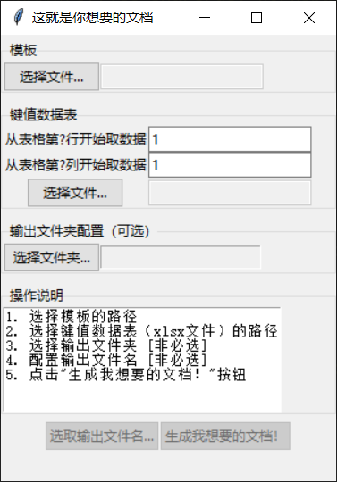

# 这就是你想要的文件 This is The Very Document yoU Want (TTVDUW)

## 这是干什么用的
这是一个**填表工具**，它可以根据**模板**和**给定表格**批量生成你想要的文件。

背景：

办公室工作总是免不了开各种奇奇怪怪证明，写各种各样会议邀请。这都21世纪20年代了，格式化的东西，就不能根据给定模板和待填数据自动生成吗？——毫无疑问是可以的，事实上不少信息系统必定会有这样的功能。

——问题是我想要批量生成的东西，系统里生成不了啊！！！例如什么成绩排名证明，还有什么在读证明，以及学生毕业设计的封面贴纸……

网上好像没有现成的个人用户app可以达成“根据模板填空”这样的目的。好在已经有能达成类似目的的[库](https://docxtpl.readthedocs.io/en/latest)了，自己写一个难度没那么大了。 ~~ 这就是给python-docx=template写的一个图形用户界面 ~~

## 配置使用环境
```shell
pip install -r requirements.txt
```
我的Python版本是3.8。不过Python 3.9、3.10应该也能使用

## 基本用法
这个app的入口是`app_main.py`。有图形用户界面和命令行两种接口。如果不带任何命令行参数执行app_main.py，就会启动图形界面。

无论使用图形界面还是命令行，都需要准备模板和键值数据表
- 用户配置模板（docx格式），在模板中设置占位符1、占位符2…… 占位符的语法是所谓的[Jinja语法](https://jinja.palletsprojects.com/en/3.0.x/templates/)，占位符两侧要用`{{  }}`包裹起来。观看examples目录中的示例文件就能大致明白该怎么书写
- 用户提供键值数据表（xlsx等），每一列为占位符1、占位符2……以及它们对应的值

### 图形用户界面


图形用户界面展现了所有的可配置项。

需要解释的可能是“选择输出文件名”（`ttvduw_gui.TtvduwGui.btn_custom_outname`）这个按钮。默认情况下，图形界面程序的输出文件名由键值数据表中的全部字段的值组成。如果你希望输出文件名只包括部分字段的值，就可点击这个按钮。点击此按钮后会弹出图中右侧的窗口，将输出文件命名时希望保留的字段保持勾选，其余取消勾选即可生效。


### 命令行
```
usage: app_main.py [-h] -t TEMPLATE -f DATA_FEEDER_FILE [-o OUT_PATH] [--tab-start-from-row TAB_START_FROM_ROW]
                 [--tab-start-from-col TAB_START_FROM_COL]
                 [--custom-out-names-with-keys CUSTOM_OUT_NAMES_WITH_KEYS [CUSTOM_OUT_NAMES_WITH_KEYS ...]]

optional arguments:
  -h, --help            show this help message and exit
  -t TEMPLATE, --template TEMPLATE
                        模板文件。docx格式
  -f DATA_FEEDER_FILE, --data-feeder-file DATA_FEEDER_FILE
                        键值数据表文件。目前只支持xlsx
  -o OUT_PATH, --out-path OUT_PATH
                        输出目录。如果不提供则根据 -t 指定的模板文件名生成
  --tab-start-from-row TAB_START_FROM_ROW
                        键值数据表文件从第几行开始有数据(default: 1)
  --tab-start-from-col TAB_START_FROM_COL
                        键值数据表文件从第几列开始有数据(default: 1)
  --custom-out-names-with-keys CUSTOM_OUT_NAMES_WITH_KEYS [CUSTOM_OUT_NAMES_WITH_KEYS ...]
                        使用哪些键的值作为输出文件名
```

通过一个例子描述会更为清楚：
```shell
python app_main.py -t "examples/成绩排名证明/成绩排名证明（推免）模板_tpl.docx" -f "examples/成绩排名证明/2022级智能建造学生成绩排名_datafeed.xlsx" --tab-start-from-row 2 --custom-out-names-with-keys stu_id stu_name
```


## 其他文件的说明
`ttvduw.py`: 底层实现
`ttvduw_gui.py`: 图形用户界面代码
`test_ttvduw.py`: 测试代码

## 功能完善路线图
目前app只有命令行界面，这对广大不熟悉命令行的职员们来说简直就是灾难。考虑实现
- [x] 一个简单的图形用户界面（使用Python自带的tkinter包）

让职员们去配置Python环境也是对大家的折磨。考虑使用[PyInstaller](https://www.pyinstaller.org/)
- [ ] 打包

目前键值数据表只实现了xlsx的支持，后续还希望实现对
- [ ] csv （通过Python自带的csv包）
- [ ] xls （通过[xlrd](https://xlrd.readthedocs.io/en/latest/)包）
的支持。

## Credits & References
开发工作还受到下面的资料的启发
- [Generating Custom Word Documents From Templates Using Python](https://blog.formpl.us/how-to-generate-word-documents-from-templates-using-python-cb039ea2c890)
- [知乎：python办公自动化（一）DocxTemplate批量生成word](https://zhuanlan.zhihu.com/p/320314207)

## 免责声明 Disclaimers
THE SOFTWARE IS PROVIDED “AS IS”, WITHOUT WARRANTY OF ANY KIND, EXPRESS OR IMPLIED, INCLUDING BUT NOT LIMITED TO THE WARRANTIES OF MERCHANTABILITY, FITNESS FOR A PARTICULAR PURPOSE AND NONINFRINGEMENT. IN NO EVENT SHALL THE AUTHORS OR COPYRIGHT HOLDERS BE LIABLE FOR ANY CLAIM, DAMAGES OR OTHER LIABILITY, WHETHER IN AN ACTION OF CONTRACT, TORT OR OTHERWISE, ARISING FROM, OUT OF OR IN CONNECTION WITH THE SOFTWARE OR THE USE OR OTHER DEALINGS IN THE SOFTWARE.

本软件由版权持有人及其他责任者“按原样”提供，包括但不限于商品的内在保证和特殊目的适用，将不作任何承诺，不做任何明示或暗示的保证。 在任何情况下，不管原因和责任依据，也不追究是合同责任、后果责任或侵权行为(包括疏忽或其它)，即使被告知发生损坏的可能性，在使用本软件的任何环节造成的任何直接、间接、偶然、特殊、典型或重大的损坏(
包括但不限于使用替代商品的后果：使用、数据或利益的损失或业务干扰)，版权持有人、其他责任者或作者或所有者概不承担任何责任。（中文翻译供参考，摘自：作者：qqwendy617 链接：https://www.zhihu.com/question/24296378/answer/138273825）
